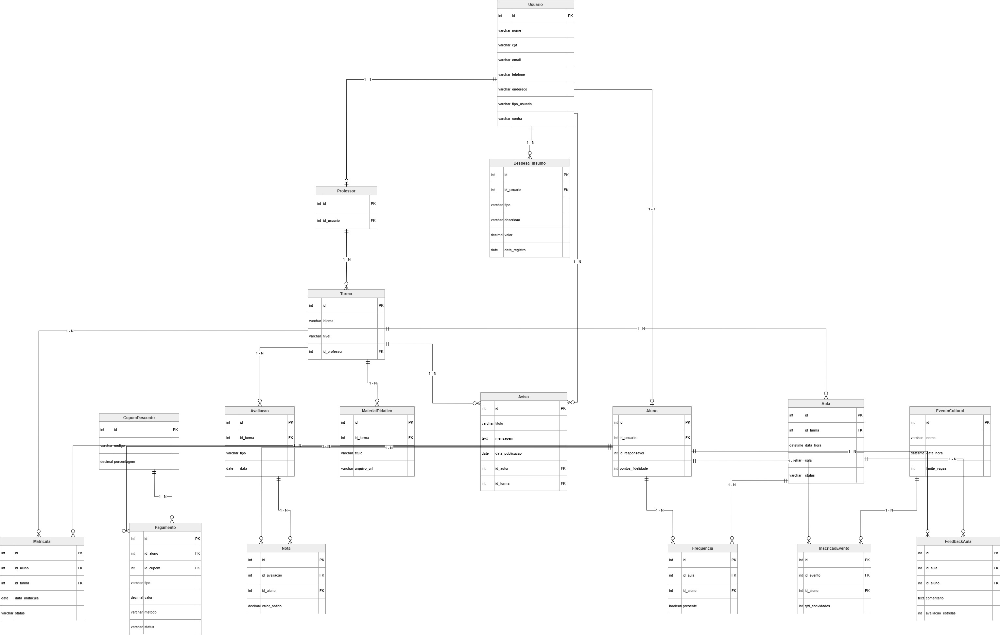

# 5. Diagrama de entidade e relacionamento 

<a href="https://drive.google.com/file/d/1M3HqhYwxxzTUhR6DLEoW_iZf1N--9uZ2/view" style="display: inline-block; background-color: white; color: #C11515; padding: 8px 12px; border-radius: 8px; text-decoration: none; font-weight: bold; margin-top: 15px;">Link do diagrama de entidade e relacionamento
</a>

