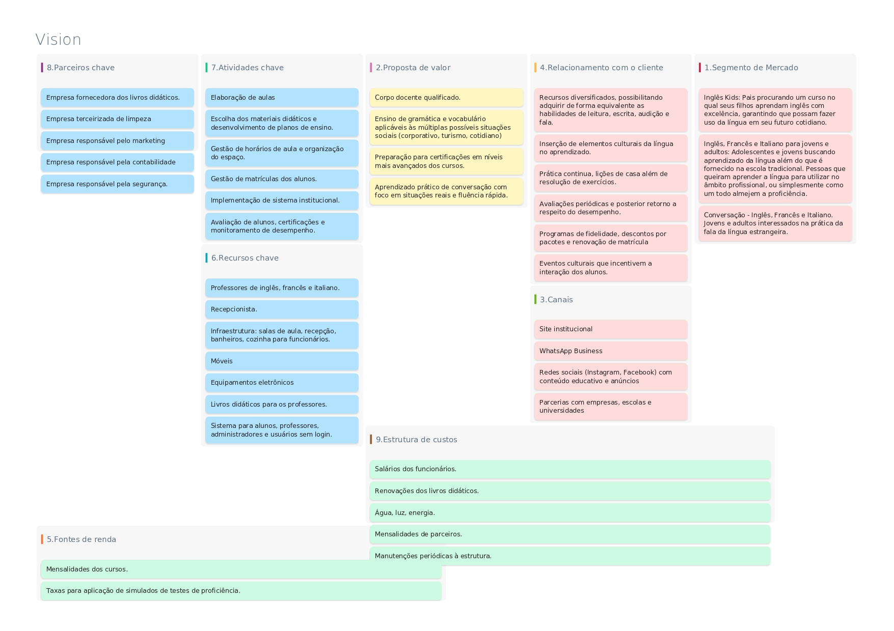

<a href="/introducao" style="display: inline-block; color: black; text-decoration: none; font-weight: bold; margin-top: 15px;">
 Voltar para a introdução
</a>
<h1 style="color: #C11515; font-weight: bold;">Descrição Geral</h1>

# **2\. Descrição do Projeto**

## **2.1 Visão Geral do Projeto**

O objetivo deste documento é fornecer uma visão geral do projeto Sistema de Gestão de Escola de Idiomas Vision. Ele descreve a finalidade do projeto, os principais stakeholders envolvidos, os requisitos principais, os diagramas de caso de uso, diagrama de classes e protótipos de possíveis telas para o sistema. 

O Sistema de Gestão de Escola de Idiomas Vision será responsável por fornecer informações gerais da escola a usuários não cadastrados, como meio de divulgação do negócio. Além disso, proporcionará  aos alunos uma plataforma digital de auxílio em seus estudos e informações gerais de atuação nos cursos em que estiver matriculado. Também funcionará como um meio de pagamento e controle de mensalidades em aberto para esses. Para mais, o sistema será utilizado para a divulgação e meio de inscrição em eventos culturais promovidos pela escola. Ademais, servirá como meio de organização de aulas e materiais dos professores e gestão financeira do negócio para os administradores.

### **2.1.1 Canvas do projeto**

<a href="https://canvas-apps.pr.sebrae.com.br/canvas?id=1608733" style="display: inline-block; background-color: white; color: #C11515; padding: 8px 12px; border-radius: 8px; text-decoration: none; font-weight: bold; margin-top: 15px;">Link do canvas
</a>

## **2.2 Stakeholders**

-   **Alunos:** usuários a quem os serviços da empresa, que consistem em aulas de idiomas, são prestados. 
    
-   **Professores:** responsáveis pelo planejamento das aulas. 
    

-  **Administradores**: responsáveis pela gestão financeira e gerenciamento do sistema.
