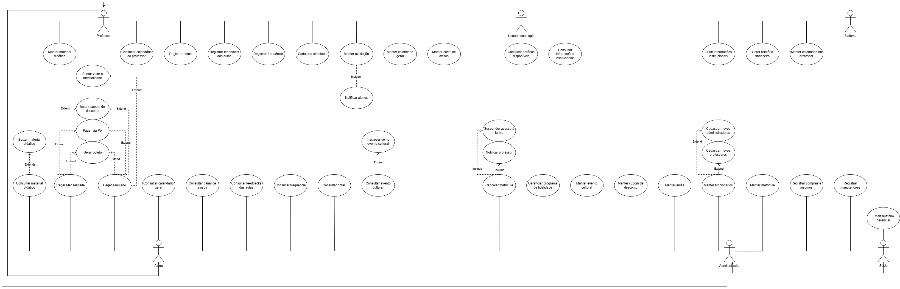

<a href="/introducao" style="display: inline-block; color: black; text-decoration: none; font-weight: bold; margin-top: 15px;">
 Voltar para a introdução
</a>
<h1 style="color: #C11515; font-weight: bold;">Desenvolvimento</h1>

## **2\. Descrição do Projeto**

### **2.1 Visão Geral do Projeto**

O objetivo deste documento é fornecer uma visão geral do projeto Sistema de Gestão de Escola de Idiomas Vision. Ele descreve a finalidade do projeto, os principais stakeholders envolvidos, os requisitos principais, os diagramas de caso de uso, diagrama de classes e protótipos de possíveis telas para o sistema. 

O Sistema de Gestão de Escola de Idiomas Vision será responsável por fornecer informações gerais da escola a usuários não cadastrados, como meio de divulgação do negócio. Além disso, proporcionará  aos alunos uma plataforma digital de auxílio em seus estudos e informações gerais de atuação nos cursos em que estiver matriculado. Também funcionará como um meio de pagamento e controle de mensalidades em aberto para esses. Para mais, o sistema será utilizado para a divulgação e meio de inscrição em eventos culturais promovidos pela escola. Ademais, servirá como meio de organização de aulas e materiais dos professores e gestão financeira do negócio para os administradores.

### **2.1.1 Canvas do projeto**

<a href="https://canvas-apps.pr.sebrae.com.br/canvas?id=1608733" style="display: inline-block; background-color: white; color: #C11515; padding: 8px 12px; border-radius: 8px; text-decoration: none; font-weight: bold; margin-top: 15px;">Link do canvas
</a>

### **2.2 Stakeholders**

-   **Alunos:** usuários a quem os serviços da empresa, que consistem em aulas de idiomas, são prestados. 
    
-   **Professores:** responsáveis pelo planejamento das aulas. 
    

-  **Administradores**: responsáveis pela gestão financeira e gerenciamento do sistema.

## **3. Principais recursos e funcionalidades**

### **3.1 Requisitos Funcionais**

RF-001 – **Exibição de Informações Institucionais**: O sistema deve exibir n a página inicial as informações gerais da escola, incluindo cursos fornecidos, horários de funcionamento, histórico da empresa, endereço completo e informações de contato. O sistema deve garantir que essas informações sejam de acesso público e de fácil visualização.

RF-002 – **Pagamento de Mensalidade via PIX**: O sistema deve permitir que o aluno realize o pagamento de mensalidades através de PIX. O sistema deve validar o status do pagamento e atualizar o histórico do aluno automaticamente após a confirmação.

RF-003 – **Pagamento de Mensalidade via Boleto**: O sistema deve permitir que o aluno realize o pagamento de mensalidades através de boleto bancário. O sistema deve registrar o boleto junto à instituição financeira cadastrada.

RF-004 – **Cadastrar Histórico Financeiro**: O sistema deve permitir o controle dos pagamentos realizados pelo aluno, bem como visualizar o seu histórico financeiro. Podendo o aluno consultar os status de cada mensalidade(pago, pendente e atrasado).

RF-005 – **Consulta de Recursos Digitais**: O sistema deve permitir que o aluno consulte e faça o download dos recursos digitais do material didático. O sistema deve filtrar e exibir os materiais correspondentes apenas aos cursos e turmas em que o aluno está ativamente matriculado.

RF-006 – **Inscrição a Eventos**: O sistema permite ao aluno realizar inscrições nos eventos culturais promovidos pela instituição, precisando informar se possui convidados extras ou restrições alimentares. O sistema deve validar se o evento ainda possui vagas disponíveis e enviar uma confirmação de inscrição para o perfil do aluno.

RF-007 – **Consulta de Notas**: O sistema deve disponibilizar ao aluno uma área para a visualização de suas notas lançadas em cada avaliação.

RF-008 – **Consulta de Frequência**: O sistema deve disponibilizar ao aluno o seu registro de frequência, exibindo o número de presenças, faltas e a porcentagem.

RF-009 – **Canal de Avisos do Aluno**: O sistema deve apresentar um mural ou canal de avisos integrado ao portal do aluno, exibindo comunicados institucionais, alertas urgentes e recados enviados pela coordenação ou professores.

RF-010 – **Atualização de Registros de Avaliações**: O sistema deve permitir que o professor atualize as informações de registros de avaliações presentes no seu plano de ensino, incluindo o tipo de avaliação (prova, trabalho, simulado), critérios de correção e datas de aplicação para as suas respectivas turmas. Essa alteração gerará um notícia no sistema.

RF-011 – **Consulta de Calendário Personalizado de Aulas**: O sistema deve gerar e exibir um calendário personalizado para o professor, agrupando cronologicamente todas as suas aulas alocadas, horários e salas de aula correspondentes.

RF-012 – **Registro de Frequência dos Alunos**: O sistema deve permitir que o professor registre a frequência dos alunos (presença ou falta) para cada aula ministrada. O sistema deve carregar a lista de chamadas automática com base nos alunos matriculados na respectiva turma e atualizar a frequência do aluno.

RF-013 – **Registro de Notas dos Alunos**: O sistema deve permitir que o professor registre as notas dos alunos nas avaliações aplicadas. O sistema deve validar se a nota inserida está dentro do intervalo numérico permitido pela instituição e atualizar nas avaliações do aluno.

RF-014 – **Registro de Alterações de Aulas pelo Professor**: O sistema deve permitir que o professor registre alterações pontuais em suas aulas (como alteração de conteúdo ou avisos de imprevistos), enviando os dados para o mural de avisos do aluno.

RF-015 – **Cadastro de Simulados**: O sistema deve permitir que o professor cadastre simulados de avaliação para suas turmas, incluindo o banco de questões, gabarito e o prazo para realização.

RF-016 – **Cadastro de Alunos e Funcionários**: O sistema permite o cadastro com informações completas, incluindo nome, CPF, data de nascimento, telefone, endereço, categoria(aluno, professor, administrador e sócio) e identificador único. O sistema deve validar dados obrigatórios e evitar duplicidade de cadastro.

RF-017 – **Relação de Contatos por Turma**: O sistema deve exibir a listagem completa de contatos dos alunos e seus responsáveis, obrigatoriamente dividida e filtrada por turma para facilitar a comunicação.

RF-018 – **Gerenciamento da Grade de Funcionários**: O sistema deve permitir a visualização, edição e alteração da escala de trabalho, horários e funções de toda a grade de funcionários da instituição.

RF-019 – **Cadastro de Materiais Didáticos**: O sistema deve permitir o cadastro de novos materiais didáticos, exigindo nome do material, autor, edição e o upload do arquivo ou link digital.

RF-020 – **Organização do Calendário Geral e Salas**: O sistema deve permitir o gerenciamento do calendário geral da escola, definindo os horários das disciplinas e alocando as salas físicas, com validação para impedir choque de horários ou salas duplicadas. O calendário geral poderá ser visualizado por alunos, professores, administradores e sócios. 

RF-021 – **Cancelamento de Matrículas**: O sistema deve permitir que a administração cancele a matrícula de alunos, registrando a data e interrompendo cobranças futuras.

RF-022 – **Registro de Substituição de Professores**: O sistema deve permitir que a administração altere o professor responsável por uma determinada aula ou período no caso de substituições e coberturas de faltas.

RF-023 – **Registro de Compras e Insumos**: O sistema deve permitir o registro financeiro de compra de insumos escolares, exigindo descrição do item, quantidade, valor pago e data da compra.

RF-024 – **Registro de Manutenções**: O sistema deve permitir o registro de despesas com manutenção da infraestrutura, solicitando a descrição do serviço, valor, fornecedor e data para fins de balanço.

RF-025 – **Cadastro de Eventos Culturais**: O sistema deve permitir o cadastro de eventos culturais na agenda da escola, exigindo nome do evento, data, horário, local e limite de participantes.

RF-026 – **Registro de Descontos e Fidelidade**: O sistema deve permitir a aplicação de descontos manuais ou automáticos nas mensalidades dos alunos e gerenciar as regras dos programas de fidelidade da escola.

RF-027 – **Unificação de Acessos dos Sócios**: O sistema deve garantir ao perfil de "Sócio" o acesso integral a todas as funcionalidades de visualização e edição contidas no módulo de Controle Administrativo.

RF-028 – **Emissão de Relatórios Gerenciais**: O sistema deve permitir que os sócios emitam relatórios gerenciais consolidados da empresa, englobando dados de faturamento, gráficos de inadimplência, evasão escolar e balanço financeiro geral.

  

**3.2 Requisitos Não Funcionais**

RNF-001 – **Segurança e Proteção de Dados**: O sistema deve garantir a proteção de dados dos usuários por meio de autenticação segura, bem como seguir as normas da LGPD (Lei Geral de Proteção de Dados), aplicando criptografia de dados sensíveis e controle de acesso baseado em perfis (Sócio e Administrador).

RNF-002 – **Controle de Acesso Baseado em Perfis**: O sistema deve restringir o acesso às funcionalidades e dados por meio de níveis de permissão (Aluno, Professor, Administrador e Sócio), garantindo que um perfil não acesse informações ou endpoints de outra categoria sem autorização explícita.

RNF-003 – **Capacidade de Conexões Simultâneas**: O sistema deve suportar até 150 conexões simultâneas de usuários ativos sem apresentar lentidão. A API deve ser capaz de processar até 100 requisições por minuto (RPM) durante os horários de pico.

RNF-004 – **Armazenamento de Arquivos Digitais**: O banco de dados e o sistema de arquivos em nuvem devem ter capacidade inicial para armazenar até 500 GB de materiais didáticos e comprovantes fiscais, prevendo uma arquitetura de expansão automática (auto-scaling de armazenamento) para suportar um crescimento de até 20% ao ano.

RNF-005 – **Suporte a Volume de Cadastros**: O sistema deve ter capacidade de processamento para manter em sua base de dados o registro ativo de até 1.000 alunos e 50 funcionários simultaneamente, sem degradação do banco de dados.

RNF-006 – **Compatibilidade com Navegadores**: O sistema deve ser totalmente funcional e compatível com as três últimas versões estáveis dos navegadores Google Chrome, Mozilla Firefox, Microsoft Edge e Safari.

RNF-007 – **Compatibilidade com Sistema Operacional**: O sistema deve ser compatível com as versões do sistema operacional mobile a partir do Android 13 e iOS 16.

RNF-008 – **Compatibilidade de Hardware**: A aplicação desktop não deve consumir mais que 4 GB de memória RAM e deve rodar em processadores com arquitetura x64.

RNF-009 – **Disponibilidade Geral**: O sistema deve estar operacional e disponível para os usuários finais 24 horas por dia, 7 dias por semana, com um índice de disponibilidade mensal de 99,9%.

RNF-010 – **Tempo de Recuperação (MTTR)**: O sistema deve possuir um Tempo Médio de Reparo (MTTR) máximo de 15 minutos para restaurar os serviços essenciais após uma falha crítica de infraestrutura.

RNF-011 – **Tolerância a Falhas**: A arquitetura deve possuir redundância ativa para suportar a queda simultânea de até 2 nós do servidor de banco de dados sem interrupção do serviço ou corrupção de dados.

RNF-012 – **Preservação de Estado**: Em caso de queda inesperada do cliente ou do servidor, o sistema deve salvar o estado da sessão do usuário para impedir o reinício forçado de processos longos.

RNF-013 – **Interface e Usabilidade**: O sistema deve possuir uma interface intuitiva e responsiva, permitindo que qualquer usuário possa se localizar no sistema e navegar por ele para realizar reservas, pagamentos e consultas com facilidade, sem a necessidade de treinamento avançado.

RNF-014 – **Tempo de Resposta da Interface:** O sistema deve processar e carregar as requisições de páginas e consultas simples (como visualização de notas ou carregamento do mural de avisos) em um tempo máximo de 2 segundos sob condições normais de rede.

RNF-015 – **Tempo de Processamento Financeiro:** A geração do QR Code do PIX ou a emissão do boleto bancário de mensalidade não deve ultrapassar o tempo limite de 5 segundos após a requisição do usuário.

RNF-016 – **Anonimização de Dados Inativos (LGPD)**: O sistema deve anonimizar todos os dados pessoais de usuários inativos há mais de 365 dias. Como métrica de sucesso, o relatório de auditoria gerado pelo sistema deve comprovar que nenhuma informação de identificação pessoal (PII) é mantida após o período limite.

RNF-017 – **Acessibilidade Digital (WCAG)**: A interface web do sistema deve cumprir integralmente o nível AA de acessibilidade do WCAG 2.2. Como métrica de sucesso, a aplicação deve atingir 100% de aprovação em ferramentas de validação automatizada de acessibilidade (como o Lighthouse).

## 4. Diagrama de Caso de Uso

<a href="https://drive.google.com/file/d/1emnoF4LvVgUk0F7hGSyu3LprZ97KdqcM/view?usp=sharing" style="display: inline-block; background-color: white; color: #C11515; padding: 8px 12px; border-radius: 8px; text-decoration: none; font-weight: bold; margin-top: 15px;">Link do diagrama de casos de uso
</a>

### 4.1 Descrição de caso de uso
<table>
        <tr>
            <th colspan="2">Consultar informações institucionais</th>
        </tr>
        <tr>
            <th>Objetivo</th>
            <td>Apresentar ao público o histórico da escola, localização física, canais de atendimento e outras informações</td>
        </tr>
        <tr>
            <th>Atores</th>
            <td>Usuário sem login.</td>
        </tr>
        <tr>
            <th>Pré-condição</th>
            <td>O usuário deve acessar a página inicial pública da escola Vision.</td>
        </tr>
        <tr>
            <th>Fluxo</th>
            <td>
                <ol>
                    <li><strong>Usuário:</strong> Navrga pela página inicial.</li>
                    <li><strong>Sistema:</strong> Exibe histórico, missão e infraestrutura.</li>
                    <li><strong>Usuário:</strong> Rola até o rodapé ou acessa o menu "Contato".</li>
                    <li><strong>Sistema:</strong> Exibe endereço, telefone, e-mail e redes sociais.</li>
                    <li><strong>Usuário:</strong> Obtém as informações desejadas.</li>
                </ol>
            </td>
        </tr>
        <tr>
            <th>Pós-condição</th>
            <td>O sistema permanece exibindo as informações institucionais de contato e localização.</td>
        </tr>
    </table>

<table>
        <tr>
            <th colspan="2">Consultar material didático</th>
        </tr>
        <tr>
            <th>Objetivo</th>
            <td>Permitir que o aluno visualize os recursos digitais disponíveis para o seu curso.</td>
        </tr>
        <tr>
            <th>Atores</th>
            <td>Aluno</td>
        </tr>
        <tr>
            <th>Pré-condição</th>
            <td>O aluno deve estar autenticado no sistema com seu login e senha.</td>
        </tr>
        <tr>
            <th>Fluxo</th>
            <td>
                <ol>
                    <li><strong>Aluno</strong> Acessa a opção "Material Didático".</li>
                    <li><strong>Sistema:</strong> Identifica o idioma e nível da(s) turma(s) do aluno.</li>
                    <li><strong>Sistema:</strong> Busca arquivos e mídias vinculados á turma.</li>
                    <li><strong>Sistema:</strong> Exibe a lista de recuros digitais.</li>
                    <li><strong>Aluno:</strong> Visualiza os títulos e tópicos.</li>
                </ol>
            </td>
        </tr>
        <tr>
            <th>Pós-condição</th>
            <td>O sistema mantém a lista de materiais aberta na tela para navegação do aluno.</td>
        </tr>
    </table>

<table>
        <tr>
            <th colspan="2">Pagar</th>
        </tr>
        <tr>
            <th>Objetivo</th>
            <td>Permitir que o aluno acesse o painel financeiro e realize o pagamento de mensalidades em aberto utilizando o método de sua preferência (Pix ou Boleto).</td>
        </tr>
        <tr>
            <th>Atores</th>
            <td>Aluno, Banco / Gateway de pagamento (secundário)</td>
        </tr>
        <tr>
            <th>Pré-condição</th>
            <td>O aluno deve estar autenticado no sistema e possuir mensalidades abertas.</td>
        </tr>
        <tr>
            <th>Fluxo Principal</th>
            <td>
                <ol>
                    <li><strong>Aluno</strong> Acessa a opção "Controle de Mensalidades".</li>
                    <li><strong>Sistema:</strong> Consulta o histórico financeiro do aluno</li>
                    <li><strong>Sistema:</strong> Exibe lista de mensalidades "Pagas" e "Em aberto".</li>
                    <li><strong>Aluno:</strong> Seleciona uma mensalidade pendente e clica em "Pagar".</li>
                    <li><strong>Sistema:</strong>Direciona para tela de escolha de forma de pagamento.</li>
                    <li><strong>Aluno:</strong> Seleciona o método de pagamento desejado.</li>
                    <li>Caso o aluno escolha Pix, será direcionado para o fluxo A. Caso escolha boleto, será direcionado ao fluxo B</li>
                </ol>
            </td>
        </tr>
        <tr>
            <th>Fluxo alternativo A</th>
            <td>
                <ol>
                    <li><strong>Sistema</strong>Envia a requisição de cobrança para o banco.</li>
                    <li><strong>Banco:</strong>Gera chave Pix e o QR Code</li>
                    <li><strong>Sistema:</strong> Exibe o QR Code e o código Pix.</li>
                    <li><strong>Aluno:</strong>Realiza o pagamento pelo aplicativo do banco.</li>
                    <li><strong>Banco:</strong>Notifica o Sistema sobre a confirmação.</li>
                    <li><strong>Sistema:</strong>Altera o status da mensalidade para “Paga”.</li>
                    <li><strong>Sistema:</strong>Exibe mensagem de confirmação.</li>
                </ol>
            </td>
        </tr>
        <tr>
         <tr>
            <th>Fluxo alternativo B</th>
            <td>
                <ol>
                    <li><strong>Sistema</strong>Envia os dados do aluno e o valor para o Banco.</li>
                    <li><strong>Banco:</strong>Registra o boleto e retorna a linha digitável e o link.</li>
                    <li><strong>Sistema:</strong>Exibe o código de barras e o botão "Baixar PDF".</li>
                    <li><strong>Aluno:</strong>Copia o código ou baixa o boleto.</li>
                </ol>
            </td>
        </tr>
              <th>Fluxo alternativo C - Pagamento recusado</th>
            <td>
                <ol>
                    <li><strong>Sistema</strong>Recebe a notificação de transação não concluída do banco</li>
                    <li><strong>Sistema:</strong>Exibe a mensagem: "Pagamento recusado. Por favor, tente novamente."</li>
                    <li><strong>Sistema:</strong>Mantém o status da mensalidade como "Em aberto".</li>
                    <li><strong>Sistema:</strong>Redireciona o aluno de volta para a tela de escolha de forma de pagamento.</li>
                </ol>
            </td>
        </tr>
        <tr>
            <th>Pós-condição</th>
            <td>A mensalidade é marcada como "Paga", caso o Pix seja aprovado, permanece "Em aberto", aguardando compensação (o pagamento do boleto ou caso o pagamento seja recusado).</td>
        </tr>
    </table>

<table>
        <tr>
            <th colspan="2">Consultar calendário geral</th>
        </tr>
        <tr>
            <th>Objetivo</th>
            <td>Permitir que o aluno visualize as datas letivas, recessos e cronogramas gerais da escola Vision.</td>
        </tr>
        <tr>
            <th>Atores</th>
            <td>Aluno</td>
        </tr>
        <tr>
            <th>Pré-condição</th>
            <td>O aluno deve estar autenticado no sistema com seu login e senha.</td>
        </tr>
        <tr>
            <th>Fluxo</th>
            <td>
                <ol>
                    <li><strong>Aluno</strong>Acessa a opção "Calendário Geral".</li>
                    <li><strong>Sistema:</strong>Busca as informações do calendário institucional.</li>
                    <li><strong>Sistema:</strong>Renderiza uma interface de calendário.</li>
                    <li><strong>Aluno:</strong>Navega pelos meses para planejar suas atividades.</li>
                </ol>
            </td>
        </tr>
        <tr>
            <th>Pós-condição</th>
            <td>O calendário permanece disponível para visualização e consulta.</td>
        </tr>
    </table>
<table>
        <tr>
            <th colspan="2">Inscrever-se em evento cultural</th>
        </tr>
        <tr>
            <th>Objetivo</th>
            <td>Realizar a inscrição do aluno em eventos e eventos culturais promovidos de forma presencial pela escola.</td>
        </tr>
        <tr>
            <th>Atores</th>
            <td>Aluno</td>
        </tr>
        <tr>
            <th>Pré-condição</th>
            <td>Deve haver um evento cultural cadastrado e com vagas abertas no sistema.</td>
        </tr>
        <tr>
            <th>Fluxo</th>
            <td>
                <ol>
                    <li><strong>Aluno</strong>Acessa a opção "Eventos Culturais".</li>
                    <li><strong>Sistema:</strong>Exibe os eventos disponíveis.</li>
                    <li><strong>Aluno:</strong>Seleciona o evento e clica em "Inscreva-se".</li>
                    <li><strong>Sistema:</strong>Verifica se há vagas.</li>
                    <li><strong>Sistema:</strong>Registra o nome do aluno na lista de participantes.</li>
                    <li><strong>Sistema:</strong>Exibe a mensagem "Inscrição confirmada!".</li>
                    <li><strong>Sistema:</strong>Abate uma vaga</li>
                </ol>
            </td>
        </tr>
        <tr>
            <th>Pós-condição</th>
            <td>O aluno passa a constar na lista oficial de presença do evento cultural.</td>
        </tr>
    </table>
<table>
        <tr>
            <th colspan="2">Consultar notas das aulas</th>
        </tr>
        <tr>
            <th>Objetivo</th>
            <td>Permitir ao aluno o acompanhamento do seu progresso pedagógico e rendimento escolar no idioma.</td>
        </tr>
        <tr>
            <th>Atores</th>
            <td>Aluno</td>
        </tr>
        <tr>
            <th>Pré-condição</th>
            <td>O aluno deve estar autenticado no sistema com seu login e senha.</td>
        </tr>
        <tr>
            <th>Fluxo</th>
            <td>
                <ol>
                    <li><strong>Aluno</strong>Acessa a opção "Informações do aluno".</li>
                    <li><strong>Sistema:</strong>Exibe as opções "Notas","Avaliações" e "Frequência".</li>
                    <li><strong>Aluno:</strong>Seleciona a opção "Notas".</li>
                    <li><strong>Sistema:</strong>Consulta notas do aluno.</li>
                    <li><strong>Sistema:</strong>Exibe os dados obtidos.</li>
                    <li><strong>Aluno:</strong>Visualiza suas notas.</li>
                </ol>
            </td>
        </tr>
        <tr>
            <th>Pós-condição</th>
            <td>As notas do aluno permanecem disponíveis visualização.</td>
        </tr>
    </table>

## 5. Diagrama de entidade e relacionamento 

<a href="https://drive.google.com/file/d/1M3HqhYwxxzTUhR6DLEoW_iZf1N--9uZ2/view?usp=sharing" style="display: inline-block; background-color: white; color: #C11515; padding: 8px 12px; border-radius: 8px; text-decoration: none; font-weight: bold; margin-top: 15px;">Link do diagrama de entidade e relacionamento
</a>

## 6. Protótipo de telas 

<a href="https://www.figma.com/design/j9gZLeueKMJrnZZNpiPhyl/Modelo-vision?node-id=0-1&t=ydaXek73CGh4EbnE-1" style="display: inline-block; background-color: white; color: #C11515; padding: 8px 12px; border-radius: 8px; text-decoration: none; font-weight: bold; margin-top: 15px;">Link do figma
</a>

## 7. Cronograma e entrega 
<table>
  <thead>
    <tr>
      <th>Fase</th>
      <th>Atividade Principal</th>
      <th>Duração</th>
      <th>Início Estimado</th>
      <th>Término Estimado</th>
      <th>Marco de Entrega (Milestone)</th>
    </tr>
  </thead>
  <tbody>
    <tr>
      <td style="text-align: center;">1</td>
      <td>Planejamento e Visão</td>
      <td>7 dias</td>
      <td>04/05/2026</td>
      <td>11/05/2026</td>
      <td>Documento de Visão e Canvas finalizados</td>
    </tr>
    <tr>
      <td style="text-align: center;">2</td>
      <td>Modelagem e Prototipagem</td>
      <td>7 dias</td>
      <td>12/05/2026</td>
      <td>19/05/2026</td>
      <td>Diagramas ER/Casos de Uso e Telas no Figma aprovados</td>
    </tr>
    <tr>
      <td style="text-align: center;">4</td>
      <td>Testes dos modelos</td>
      <td>7 dias</td>
      <td>20/05/2026</td>
      <td>27/05/2026</td>
      <td>Revisões e correções do projeto</td>
    </tr>
    <tr>
      <td style="text-align: center;">5</td>
      <td>VitePress, Deploy Vercel e Apresentação</td>
      <td>7 dias</td>
      <td>28/05/2026</td>
      <td>04/06/2026</td>
      <td>Link do Vercel gerado e apresentação pronta</td>
    </tr>
  </tbody>
</table>

## 8\. Riscos e Mitigação

Entre os principais riscos do projeto está a dificuldade de angariar alunos devido à competitividade do setor de cursos de idiomas, somada à falta de reconhecimento do negócio no mercado. Para mitigar a problemática, a Vision busca investir em materiais didáticos de qualidade reconhecida no meio de publicações de idiomas, além de diferenciais metodológicos nas aulas, por meio do sistema a ser implementado e dos eventos promovidos, assim estabelecendo um diferencial de relacionamento com seus alunos. 

Outro risco significativo é a baixa de matrículas ao longo do ano, sendo que as adesões de novos alunos majoritariamente se concentram no início do ano letivo e, dada a possibilidade de desistências, isso poderia acarretar perda significativa no número de matrículas ao longo do ano. A fim de atenuar esse problema, a Vision contará com tempos de duração diferentes dentro dos níveis dos cursos fornecidos, estimulando, principalmente nos níveis iniciais, a realização de novas matrículas ao longo do ano. 

Destaca-se também o risco de desistência dos alunos com dificuldade de aprendizagem que, além de fazer com que a escola não cumpra o objetivo principal de seu serviço, também desestimularia o ingresso de clientes em potencial que acompanhassem tal experiência. Para diminuir essa ameaça, a Vision foca no constante acompanhamento da evolução de seus alunos, buscando recomendar lições de casa focadas na retomada de defasagens apresentadas nas avaliações ao longo do curso. Ademais, na conclusão de cada nível, a Vision realiza questionários de satisfação com seus alunos, buscando entender suas necessidades e as capacidades de melhoria do serviço prestado.

## 9. Custos e Orçamento

### Orçamento de TI 
<table>
  <thead>
    <tr>
      <th style="text-align: left;">Categoria</th>
      <th style="text-align: left;">Item</th>
      <th style="text-align: left;">Descrição</th>
      <th style="text-align: center;">Tipo</th>
      <th style="text-align: right;">Valor</th>
    </tr>
  </thead>
  <tbody>
    <tr>
      <td>Serviços</td>
      <td>Desenvolvimento</td>
      <td>Criação do sistema base (alunos, profs, admin, s)</td>
      <td style="text-align: center;">CAPEX</td>
      <td style="text-align: right;">R$ 22.000,00</td>
    </tr>
    <tr>
      <td>Hardware</td>
      <td>Computadores</td>
      <td>Computadores para administração e laboratório</td>
      <td style="text-align: center;">CAPEX</td>
      <td style="text-align: right;">R$ 12.000,00</td>
    </tr>
    <tr>
      <td>Infraestrutura</td>
      <td>Rede</td>
      <td>Roteadores e cabeamento</td>
      <td style="text-align: center;">CAPEX</td>
      <td style="text-align: right;">R$ 3.500,00</td>
    </tr>
    <tr>
      <td>Software</td>
      <td>Licenças e APIs</td>
      <td>Integrações financeiras e ferramentas de terceiros</td>
      <td style="text-align: center;">OPEX</td>
      <td style="text-align: right;">R$ 1.500,00</td>
    </tr>
    <tr>
      <td>Serviços</td>
      <td>Suporte</td>
      <td>Suporte técnico e manutenção mensal do software</td>
      <td style="text-align: center;">OPEX</td>
      <td style="text-align: right;">R$ 1.200,00</td>
    </tr>
    <tr>
      <td colspan="4" style="text-align: right; font-weight: bold;">Total CAPEX</td>
      <td style="text-align: right; font-weight: bold;">R$ 37.500,00</td>
    </tr>
    <tr>
      <td colspan="4" style="text-align: right; font-weight: bold;">Total OPEX</td>
      <td style="text-align: right; font-weight: bold;">R$ 2.700,00</td>
    </tr>
  </tbody>
</table>

### Custos de estrutura e operação 
<table>
  <thead>
    <tr>
      <th style="text-align: left;">Categoria</th>
      <th style="text-align: left;">Item</th>
      <th style="text-align: left;">Descrição</th>
      <th style="text-align: left;">Tipo</th>
      <th style="text-align: right;">Valor</th>
    </tr>
  </thead>
  <tbody>
    <tr>
      <td>Reforma</td>
      <td>Pintura</td>
      <td>Pintura das salas e fachada</td>
      <td>Investimento Inicial</td>
      <td style="text-align: right;">R$ 8.000,00</td>
    </tr>
    <tr>
      <td>Reforma</td>
      <td>Piso</td>
      <td>Troca do piso da recepção</td>
      <td>Investimento Inicial</td>
      <td style="text-align: right;">R$ 4.500,00</td>
    </tr>
    <tr>
      <td>Mobiliário</td>
      <td>Cadeiras</td>
      <td>Cadeiras para alunos</td>
      <td>Investimento Inicial</td>
      <td style="text-align: right;">R$ 12.000,00</td>
    </tr>
    <tr>
      <td>Mobiliário</td>
      <td>Mesas</td>
      <td>Mesas para professores</td>
      <td>Investimento Inicial</td>
      <td style="text-align: right;">R$ 3.000,00</td>
    </tr>
    <tr>
      <td>Equipamentos</td>
      <td>Ar Condicionado</td>
      <td>Instalação em 5 salas</td>
      <td>Investimento Inicial</td>
      <td style="text-align: right;">R$ 15.000,00</td>
    </tr>
    <tr>
      <td>Marketing</td>
      <td>Letreiro</td>
      <td>Letreiro luminoso fachada</td>
      <td>Investimento Inicial</td>
      <td style="text-align: right;">R$ 2.500,00</td>
    </tr>
    <tr>
      <td>Operação</td>
      <td>Aluguel</td>
      <td>Aluguel do imóvel</td>
      <td>Custos Operacionais</td>
      <td style="text-align: right;">R$ 6.000,00</td>
    </tr>
    <tr>
      <td>Operação</td>
      <td>Energia</td>
      <td>Conta de luz</td>
      <td>Custos Operacionais</td>
      <td style="text-align: right;">R$ 1.200,00</td>
    </tr>
    <tr>
      <td>Operação</td>
      <td>Água</td>
      <td>Conta de água</td>
      <td>Custos Operacionais</td>
      <td style="text-align: right;">R$ 300,00</td>
    </tr>
    <tr>
      <td>Operação</td>
      <td>Internet</td>
      <td>Link dedicado</td>
      <td>Custos Operacionais</td>
      <td style="text-align: right;">R$ 400,00</td>
    </tr>
    <tr>
      <td>Pessoal</td>
      <td>Recepção</td>
      <td>Salário recepcionista</td>
      <td>Custos Operacionais</td>
      <td style="text-align: right;">R$ 2.500,00</td>
    </tr>
    <tr>
      <td>Pessoal</td>
      <td>Limpeza</td>
      <td>Serviço terceirizado</td>
      <td>Custos Operacionais</td>
      <td style="text-align: right;">R$ 1.800,00</td>
    </tr>
    <tr>
      <td>Marketing</td>
      <td>Anúncios</td>
      <td>Google Ads e Redes Sociais</td>
      <td>Custos Operacionais</td>
      <td style="text-align: right;">R$ 1.500,00</td>
    </tr>
    <tr>
      <td>Manutenção</td>
      <td>Reparos</td>
      <td>Fundo de reserva</td>
      <td>Custos Operacionais</td>
      <td style="text-align: right;">R$ 500,00</td>
    </tr>
    <tr>
<td colspan="4" style="text-align: right; font-weight: bold;">Total Investimento Inicial</td>
      <td style="text-align: right; font-weight: bold;">R$ 45.000,00</td>
    </tr>
    <tr>
      <td colspan="4" style="text-align: right; font-weight: bold;">Total Custos Operacionais</td>
      <td style="text-align: right; font-weight: bold;">R$ 14.200,00</td>
    </tr>
  </tbody>
</table>

## 10\. Considerações Finais

Este documento de visão fornece uma visão geral do projeto Sistema de Gestão de Escola de Idiomas Vision. Ele descreve a finalidade, os principais stakeholders, os requisitos principais, os diagramas de caso de uso, diagrama de classes e protótipos de possíveis telas para o sistema. Este documento servirá como base para o desenvolvimento do projeto, auxiliando na compreensão e alinhamento das partes interessadas.

Ao estabelecer este mapeamento detalhado, a documentação não apenas mitiga riscos durante a fase de codificação, mas também funciona como um guia de validação para testes, assegurando que o produto final entregue uma experiência fluida, segura e perfeitamente alinhada às necessidades reais de alunos, professores, administradores e sócios.